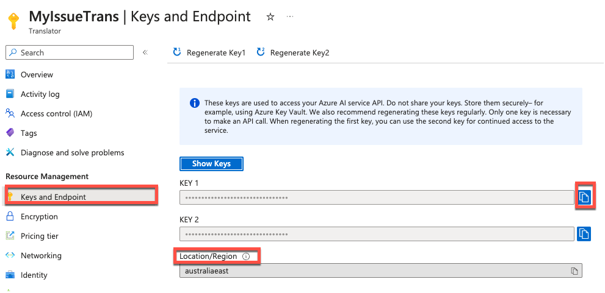
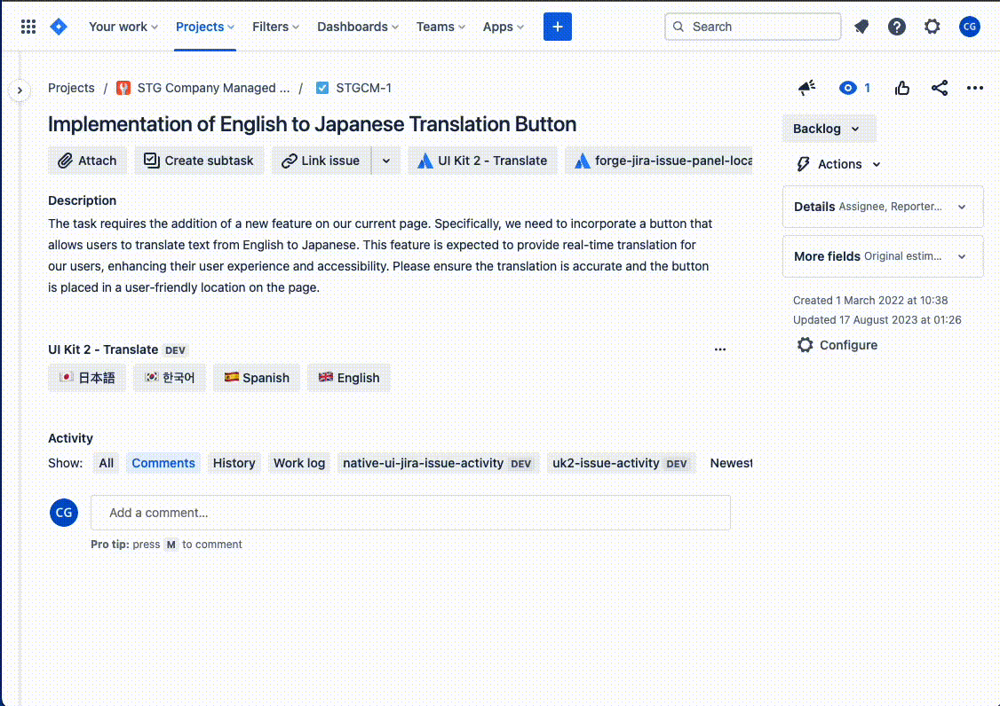

# UI Kit 2 - Issue Translation

[](LICENSE)

This is an example [UI Kit 2 - Forge app](https://developer.atlassian.com/platform/forge/ui-kit-2/) that translates Jira issue fields contents into a range of different languages using the [Azure Translator Text API](https://learn.microsoft.com/en-us/azure/ai-services/translator/).

**Note**: This example app is based off of the [UI Kit - Issue translator app](https://bitbucket.org/atlassian/forge-issue-translation/src/master/) example application.

## Requirements

See [Set up Forge](https://developer.atlassian.com/platform/forge/set-up-forge/) for instructions to get set up.

## Quick start

Once you have logged into the CLI (`forge login`), follow the steps below to install the app onto your site:

1. Clone this repository:
    
    `git clone git@bitbucket.org:atlassian/forge-ui-kit-2-translate.git`
1. Change to the app directory:

    `cd forge-ui-kit-2-translate`

1. Register the app:
   
    `forge register`

1. Build and deploy your app by running:

    `forge deploy`

1. Install your app in an Atlassian site by running:

    `forge install`

1. Develop your app by running `forge tunnel` to proxy invocations locally:

    `forge tunnel`

## Installation

1. [Sign up for the Azure Translator Text API](https://learn.microsoft.com/en-us/azure/ai-services/translator/create-translator-resource) (the free tier allows 2 million characters per month at time of writing)
1. Find your **Authentication key** and **Location** on the "Keys and Endpoint" page.
   
1. Set an encrypted [environment variable](https://developer.atlassian.com/platform/forge/environments/) keyed by `TRANSLATE_API_KEY` with a value of your Translator Text API **Authentication key**. `forge variables set --encrypt TRANSLATE_API_KEY xxxxxxxxxx`.
1. Set the `TRANSLATE_API_LOCATION` environment variable to the value of your Translator Text API **Location**. `forge variables set TRANSLATE_API_LOCATION xxxxxxxxxx`.
1. Run `forge deploy` to deploy the changes to your environment variables.
1. You're done! Test out the app by browsing to a Jira issue and clicking one of the buttons on the "Translate" panel.

## Usage

Press the corresponding button on the issue view to translate the issue summary and description into the language of your choice.



This app is designed as a Forge reference example for developers. There are no user-facing configuration options, but you can modify the supported languages and translated fields by editing `src/frontend/index.jsx`.

## Debugging

You can enable verbose logging by setting the `DEBUG_LOGGING` [environment variable](https://developer.atlassian.com/platform/forge/environments/) to `1`. Logs can then be viewed with the `forge logs` command.

Alternatively, you can use the [`forge tunnel`](https://developer.atlassian.com/platform/forge/change-the-frontend-with-forge-ui/#set-up-tunneling) command to run your Forge app locally. Note that you must pass the environment variable values to the tunnel with the prefix `FORGE_USER_VAR_`, e.g.:

```
FORGE_USER_VAR_TRANSLATE_API_KEY=your_translate_api_key_here FORGE_USER_VAR_DEBUG_LOGGING=1 forge tunnel
```

## License

Copyright (c) 2023 Atlassian and others.
Apache 2.0 licensed, see [LICENSE](LICENSE) file.

[](https://www.atlassian.com)
